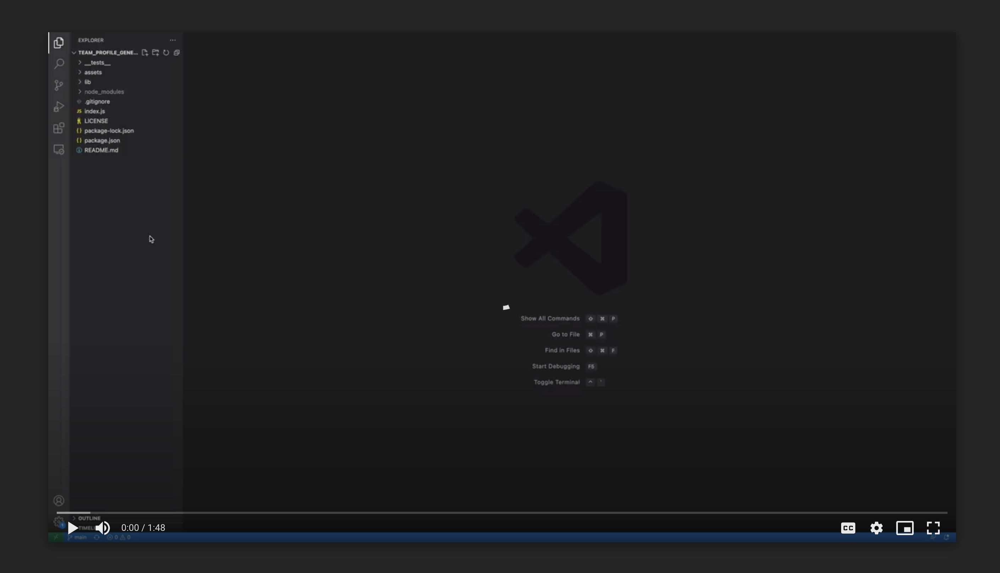

# Team Profile Generator

---
## Description

A Node.js command-line application that takes in information about employees on a software engineering team, then generates an HTML webpage that displays summaries for each person. 

---
## Table of Contents

- [Installation](##Installation)

- [Usage](##Usage)

- [License](##License) 

- [Tests](##Tests)

- [Questions](##Questions)

---
## Installation

- First, use git clone in the terminal to download the project 
- Then open the project in VS Code and in the package.json folder enter the terminal 
- Within the terminal, use npm install to install the package.json
- The command-line application should work when npm start is entered into the terminal 

---
## Usage

This application can allow users to quickly and easily create a team profile HTMLs by using a command-line application.

### Screenshot:

### Walkthrough Video:

--- 
 
 ## License 
 
 https://opensource.org/licenses/MIT

---
## Tests

Run npm test to run Jest for tests on constructors.

---
## Questions

If you have any questions or concerns please contact me at bxz5089@gmail.com or checkout my GitHub page at [bxz5089](https://github.com/bxz5089/).